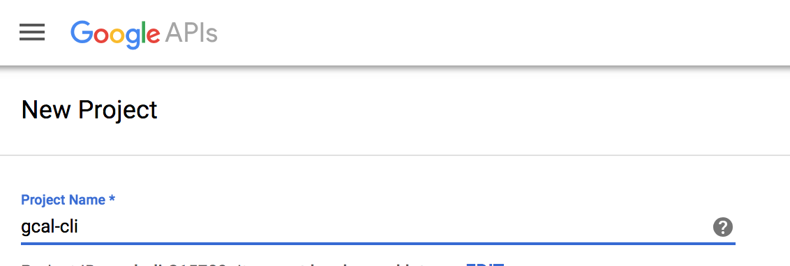
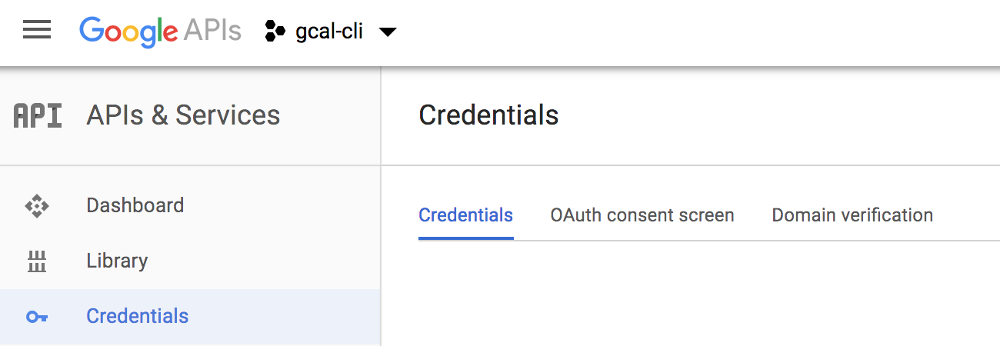
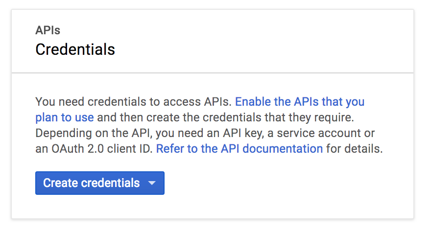
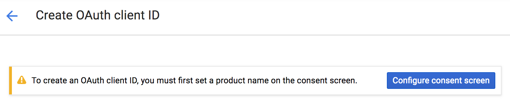
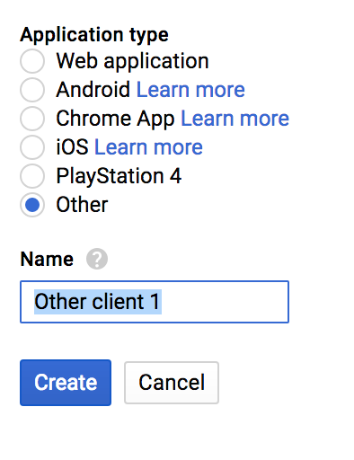
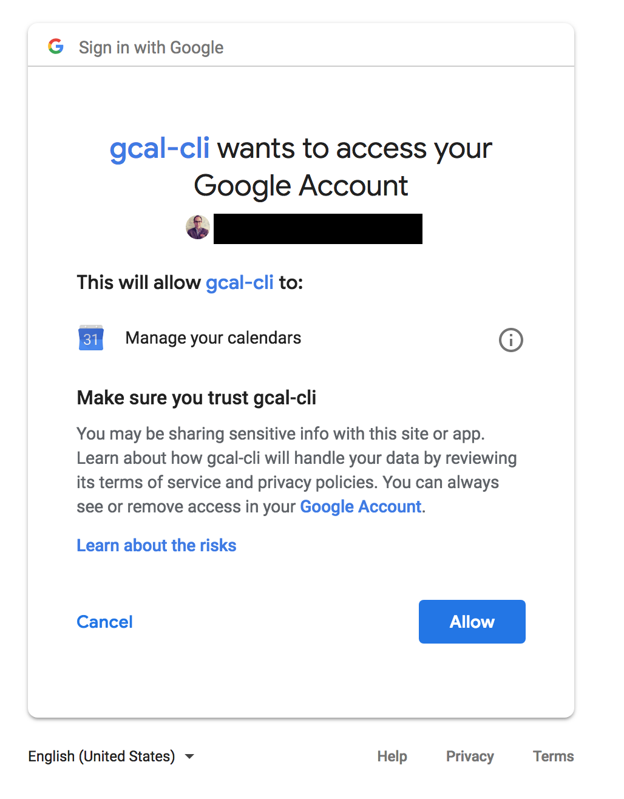
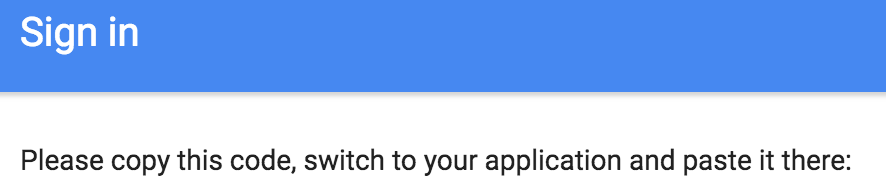
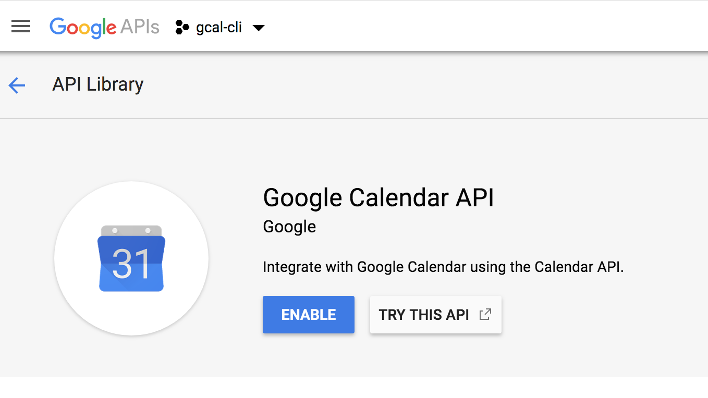

# Authentication

> step by step Authorization and authentication  with Google Calendar

## Create first a project

1. New project from [Developer Console](https://console.developers.google.com/projectcreate)
2. Fill a project name




## Get your project credentials

1. Open the credentials page https://console.developers.google.com/apis/credentials



2. Select your project
3. Create credentials `Auth client ID`



4. Click on `Configure consent screen`



5. Fill mandatory field `Product name`
7. Save and choose  `Other` as `Application type`



7. [Download the json file for your created project](https://console.developers.google.com/apis/credentials)


## Generate consent page URL

1. Generate the content page URL from command line

```
❯ gcal generateUrl
```

2. Open in your browser the prompted generated url



## Store the token

1. Copy the generated token



2. Paste and store in `~`

```
❯ gcal storeToken <code-previously-paste>
```

## Enable the api

```
❯ gcal enable
```

If not yet enabled, a prompt with a calendar API link is shown.


